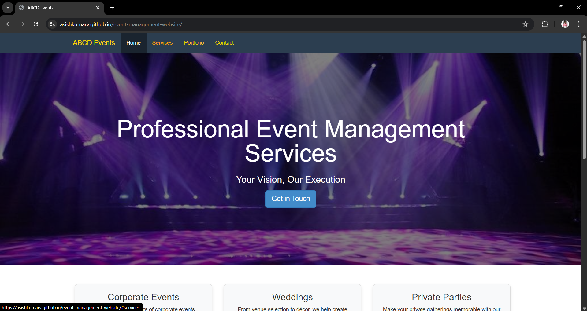
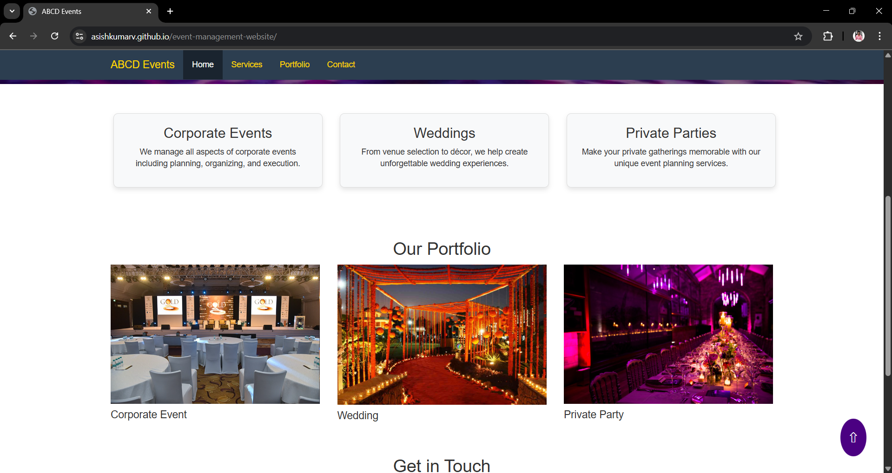

# 🎉 Event Management Website

A simple and modern event management website built using **HTML**, **CSS**, and **JavaScript**. It is designed for event organizers to showcase their services, upcoming events, and provide contact options.

---

## 🖼️ Screenshots

# Homepage


# Events


# Get in touch


## 🌟 Features

- Responsive and modern UI
- Hero banner with event highlights
- About us / Services section
- Contact form (basic HTML)
---

## 💻 How to Run This Project Locally

1. **Clone the repository**
   ```bash
   git clone https://github.com/yourusername/event-management-website.git
2. **Navigate to the folder**
     -cd event-management-website
4. Open index.html in your browser

    Option 1: Double-click index.html

    Option 2 (Recommended): Use Live Server if you're using VS Code
---
🔗 Live Demo

https://asishkumarv.github.io/event-management-website/

---
🛠️ Technologies Used

-HTML5

-CSS3 

-JavaScript

---
🙋‍♂️ Author
Asish Kumar Varanasi

GitHub: @asishkumarv

Email: asishkumarv@gmail.com


 
